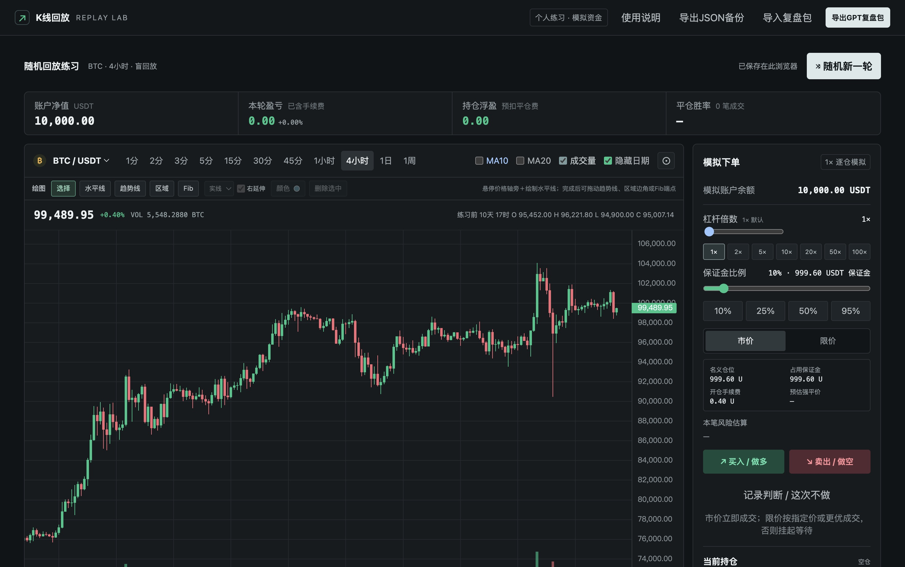
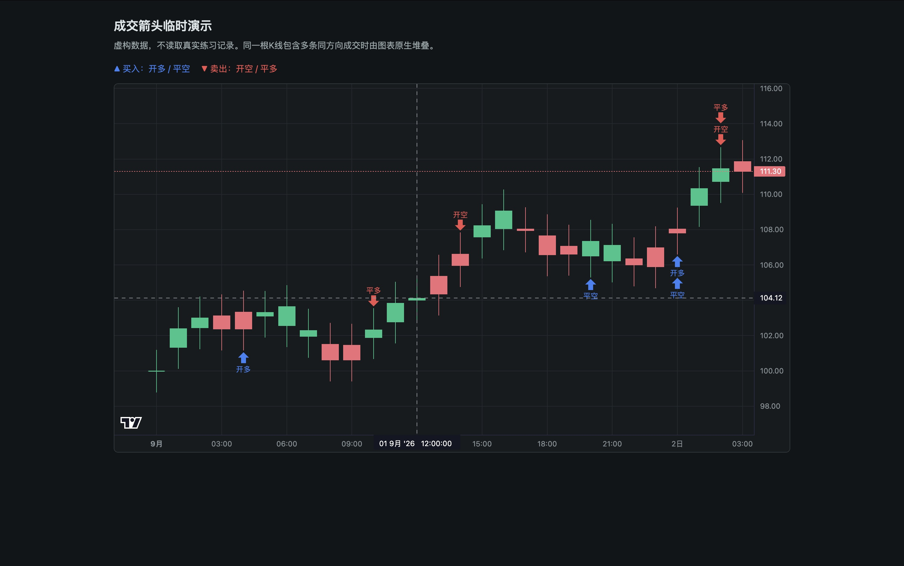
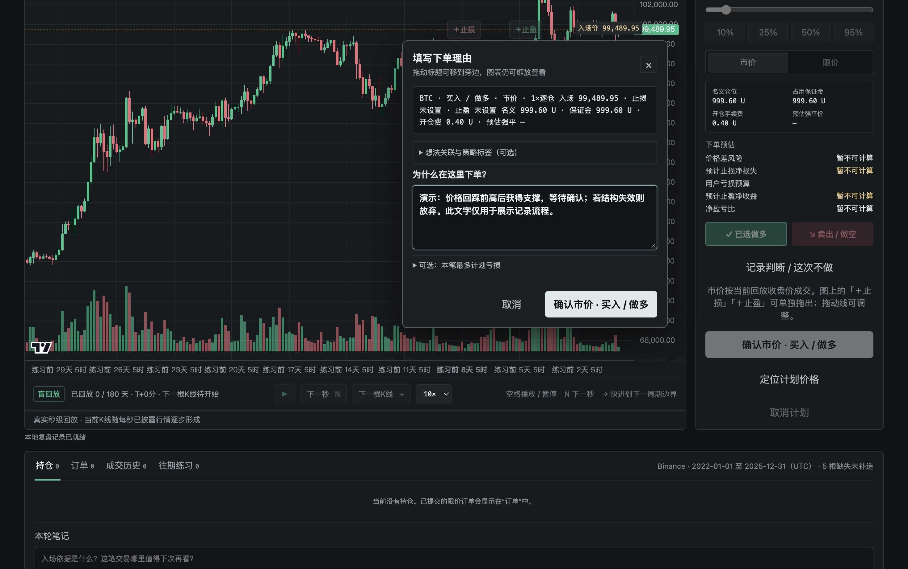

# K线回放

<p align="center">
  <strong>在真实历史行情里练习读图、下单与复盘</strong><br>
  本地运行 · 无需登录 · 不连接交易账户 · 不会实际下单
</p>

<p align="center">
  
  
  
  
</p>

K线回放是一款浏览器本地运行的历史行情回放工具。它会隐藏未来行情，让你在 BTC/USDT、ETH/USDT 的真实历史数据中逐秒或逐分钟推进，完成模拟交易、画图分析和证据化复盘。

> [!IMPORTANT]
> 本项目只用于学习和模拟训练。所有订单、盈亏和强平都由本地模拟引擎计算，不会连接交易所账户，也不会产生真实交易。

## 导航

- [界面预览](#界面预览)
- [功能概览](#功能概览)
- [开始使用](#开始使用)
- [一轮练习怎么做](#一轮练习怎么做)
- [快捷键](#快捷键)
- [行情与模拟边界](#行情与模拟边界)
- [隐私与复盘导出](#隐私与复盘导出)
- [常见问题](#常见问题)
- [开发与测试](#开发与测试)

## 界面预览

### 主界面



*主界面使用历史数据演示。*

### 成交箭头



*成交箭头的独立模拟数据演示；不代表真实交易。*

### 下单理由



*可拖动的下单理由浮窗，内容为演示数据。*

## 功能概览

| 模块 | 已实现能力 |
|---|---|
| 行情 | BTC/USDT、ETH/USDT；Binance 现货公开历史数据；真实 1 秒或 1 分钟 OHLCV 按需读取 |
| 周期 | 1 / 2 / 3 / 5 / 15 / 30 / 45 分钟，1 小时、4 小时、日线、周线 |
| 回放 | 逐秒、逐分钟、快进到下一根；多档速度；隐藏真实日期；未来 K 线不提前显示 |
| 指标 | MA10、MA20、成交量，可独立显示或隐藏 |
| 模拟交易 | 市价、限价、做多、做空；1–100× 逐仓杠杆；保证金比例；止损、止盈、撤单、主动平仓、预估强平 |
| 交易纪律 | 下单与主动平仓必须填写理由；可记录亏损预算、关联想法、尝试次数和策略版本 |
| 绘图 | 水平线、趋势线、供需区/订单块、Fib 回撤；支持拖动、删除与颜色调整，Fib 另支持线型和右延伸 |
| 图表标记 | 实际模拟成交后显示小箭头：买入为蓝色 `↑`（开多/平空），卖出为红色 `↓`（开空/平多） |
| 复盘 | 保存练习轮次、补记计划与观察；导出 JSON 备份或带报告、截图和校验清单的 GPT 复盘 ZIP |
| 隐私 | 练习资料保存在当前浏览器的本地存储中；本地服务只监听 `127.0.0.1` |

## 开始使用

当前仓库没有预先制作好的 Release 安装包。可以直接从源码运行，macOS 用户也可以自行打包 `.app`。

### 方式一：从源码运行（macOS / Linux）

建议使用 Python 3.10 或更新版本；运行过程只使用 Python 标准库，不需要安装额外依赖。以下命令还需要 Git。也可以在 GitHub 下载源码 ZIP，解压后进入项目目录，再运行第三行启动命令。

```sh
git clone --branch codex/initial-release https://github.com/wei04459-blip/kline-replay.git
cd kline-replay
python3 macos/Contents/Resources/serve.py --bind 127.0.0.1 --port 8765 --directory dist
```

然后打开 <http://127.0.0.1:8765>。服务在终端前台运行，按 `Control-C` 停止。

macOS 也可以在 Finder 中双击 `启动练习场.command`，结束时双击 `停止练习场.command`。启动器只会管理由它记录、且命令路径完全匹配的本项目服务。

### 方式二：从源码运行（Windows）

建议安装 Python 3.10 或更新版本，并准备 Git，然后在 PowerShell 中运行。也可以在 GitHub 下载源码 ZIP，解压后进入项目目录，直接运行第三行启动命令。

```powershell
git clone --branch codex/initial-release https://github.com/wei04459-blip/kline-replay.git
cd kline-replay
py -3 macos/Contents/Resources/serve.py --bind 127.0.0.1 --port 8765 --directory dist
```

然后打开 <http://127.0.0.1:8765>。按 `Ctrl+C` 停止服务。

### 方式三：自行构建 macOS 应用

在 macOS 的项目根目录运行：

```sh
python3 scripts/打包桌面应用.py
```

构建完成后会得到 `build/K线回放.app`。你可以把它复制到桌面或“应用程序”目录，再双击启动。脚本依赖 macOS 自带的 `iconutil`，不会自动启动应用，也不会覆盖已有同名应用；如果输出目录里已经存在应用包，请先自行移走或改名。

更新源码后，桌面上的旧 `.app` 不会自动更新，需要重新构建并重新复制。

> [!NOTE]
> 不要用 `python3 -m http.server` 代替项目自带服务。普通静态服务器只能预览仓库内置图表，无法提供真实 1 秒/1 分钟行情接口，也不能完整推进练习。

## 一轮练习怎么做

1. **开始新一轮**：选择 BTC 或 ETH，系统随机进入一段历史行情；可开启“隐藏日期”减少记忆干扰。
2. **只看已经发生的行情**：选择逐秒或分钟模式，按自己的节奏播放、暂停或单步推进。
3. **写清交易计划**：选择市价/限价、做多/做空、杠杆和保证金比例；按需设置止损、止盈，并在图表上画线辅助判断。
4. **提交理由**：确认下单前必须填写理由。限价单未触发时保持挂单；市价单按当前已揭示收盘价和模拟滑点成交。
5. **管理持仓**：保护线可在图上调整，修改先预览，确认后才生效。主动平仓也必须填写理由。
6. **复盘**：在底部查看成交与往期练习，补充事后观察；需要迁移资料时导出 JSON，需要交给 AI 深度复盘时导出 GPT 复盘包。

每轮只管理一个当前挂单或一笔持仓。切换品种或开始新一轮时，未成交挂单会被取消并归档；如有持仓，需要先完成主动平仓理由。

### 图上下单和画图

| 操作 | 怎么做 |
|---|---|
| 限价入场 | 选择“限价”和方向后，在图上选择入场价；未成交前可继续拖动修改 |
| 止损 / 止盈 | 从入场价旁拖出“＋止损”或“＋止盈”；二者可只设一个，也可都不设置 |
| 修改订单线 | 挂单或持仓期间拖动线位只是预览，需要在右侧确认修改；取消则恢复实际价位 |
| 水平线 | 把鼠标移到图表绘图区，在右侧价格轴旁点 `＋`，再选择绘制水平线 |
| 趋势线 | 选择“趋势线”，依次点击起点和终点；完成后可拖动端点或整条线 |
| 区域 | 选择“区域”，依次点击矩形的两个对角；完成后可拖动整体、边缘或角点 |
| Fib 回撤 | 选择 Fib 后依次点击起点和终点；可拖动端点或整组线，并调整颜色、线型与右延伸 |
| 选中与删除 | 选中图形后可拖动或换色；点击“删除选中”，也可按 `Delete` / `Backspace` 删除 |

下单理由浮窗可以拖到图表旁边，填写时仍能缩放和拖动图表。提交或取消后，回放会恢复浮窗打开前的播放状态。主动平仓需要填写理由；自动止损、止盈和强平不要求填写平仓理由。

## 快捷键

| 按键 | 作用 |
|---|---|
| `Space` | 播放 / 暂停 |
| `N` | 逐秒模式前进一秒；分钟模式前进一分钟 |
| `→` | 快进到当前周期的下一根边界 |
| `Esc` | 退出当前绘图工具、关闭绘图菜单或取消选中 |
| `Delete` / `Backspace` | 删除当前选中的图形 |
| `↑` / `↓` | 聚焦价格线控制点时微调计划价格 |

在输入框中输入文字时，回放快捷键不会抢占按键。

## 行情与模拟边界

### 行情来源与粒度

- 仓库内置 BTC/USDT、ETH/USDT 的 Binance Vision 现货 15 分钟背景数据，范围为 **2022-01-01 至 2025-12-31（UTC）**。
- 完整回放由本地服务按 UTC 日读取并校验 Binance 官方公开的 1 秒或 1 分钟现货归档。首次进入尚未缓存的日期需要联网；之后可读取本机缓存。
- “真实 1 秒”指每秒一根 OHLCV 汇总 K 线，**不是 tick，也不是逐笔成交记录**。它无法还原同一秒内每笔交易的先后顺序。
- 短周期 K 线由已经揭示的真实秒线或分钟线聚合；缺失数据保留为空档，不从 15 分钟 K 线反推，也不插值补造。
- 所有界面时间按 UTC 显示。Binance 官方日归档通常需要到次日才发布，因此本工具定位于历史练习。

### 模拟成交规则

默认初始余额为 10,000 USDT，手续费单边 0.04%，成交计入 0.02% 不利滑点。杠杆为 1–100× 逐仓模拟，预估强平使用固定 0.5% 维持保证金率。

为了不从 OHLC 数据虚构分钟/秒内路径，引擎采用可重复的保守规则：

- 市价单按当前已经揭示的收盘价加模拟滑点成交。
- 限价单按指定价或更优价格成交；未触发则继续挂单。
- 同一观测 K 线同时触及止损和止盈时，按止损先触发处理。
- 限价入场所在观测区间会检查止损和强平，止盈从下一个观测区间开始检查。
- 开盘跳空越过保护价时，以已经观察到的开盘价处理；强平优先级按引擎的保守保护阈值规则判断。

这些结果不包含盘口深度、资金费、真实标记价格、分档维持保证金或交易所实际撮合。强平价与盈亏都是训练用估算，不代表真实成交或投资结果。

<details>
<summary>已知行情缺口</summary>

Binance 官方归档在 2023-03-24 12:45 至 13:45 UTC 缺少 5 根 15 分钟 K 线；对应 1 分钟归档在 12:40 至 13:59 UTC 缺少 80 根。项目保留原始空档，不插值，也不会伪造价格。

</details>

## 隐私与复盘导出

练习索引和轻量状态保存在当前站点的 `localStorage`，完整事件、截图等较大资料保存在同站点的 IndexedDB。它们由浏览器保存在本机，本页面不会主动上传到云端。

浏览器、浏览器配置文件、域名和端口共同决定站点存储空间。因此 Chrome 与 Safari、普通窗口与其他配置文件、`127.0.0.1:8765` 与其他端口之间的记录不会自动互通。清除对应站点数据会删除练习记录，请提前导出备份。

### JSON 备份与 GPT 复盘包有什么区别？

| 格式 | 适合用途 | 包含内容 |
|---|---|---|
| JSON 备份 | 保存状态、迁移往期练习、以后重新导入 | 结构化状态；不包含完整分钟证据和全部截图 |
| GPT 复盘 ZIP | 深度复盘、留存证据、交给支持附件分析的 AI | 中文报告、结构化记录、派生指标、离线复盘册、关键截图、已披露行情切片和 SHA-256 清单 |

复盘包以点击导出时的状态为截止点，只纳入当时已经揭示的行情；不会导出未来 K 线。导入复盘包只会加入往期档案，不会替换当前练习或恢复旧撮合状态。

ZIP 能否直接被聊天工具读取，取决于该聊天产品和当前会话的附件能力。为了提高成功率，建议先解压，再上传报告、结构化记录和需要分析的截图。即使工具接受 ZIP，也不保证它会自动读取并理解包内全部文件。

## 常见问题

<details>
<summary><strong>为什么第一次进入某个日期比较慢？</strong></summary>

本地服务需要联网下载该 UTC 日的 Binance 官方行情与 `.CHECKSUM`，完成 SHA-256 校验后才会使用。相同日期后续可从本机缓存读取。网络失败或校验不通过时，页面会报错并保留当前位置，不会补造价格。

</details>

<details>
<summary><strong>换了浏览器，为什么看不到原来的记录？</strong></summary>

练习记录属于浏览器的站点存储，不同浏览器和浏览器配置文件彼此隔离。请在原浏览器导出 JSON 或 GPT 复盘包，再到新环境导入。

</details>

<details>
<summary><strong>换了端口，记录为什么也不见了？</strong></summary>

浏览器会把不同端口视为不同站点。请尽量固定使用 `http://127.0.0.1:8765`。原端口的数据仍在原站点存储中，除非你清理了浏览器数据。

</details>

<details>
<summary><strong>可以离线使用吗？</strong></summary>

内置 15 分钟图表可以离线查看；完整回放需要目标日期已经缓存。首次下载某个日期必须联网。删除本地行情缓存不会删除浏览器中的练习记录，但离线时将无法重新读取未缓存行情。

</details>

<details>
<summary><strong>为什么不能直接双击 index.html？</strong></summary>

真实秒线、分钟线和缓存校验由项目自带的本地服务提供。直接打开 HTML 或使用普通静态服务器都缺少这些接口。

</details>

<details>
<summary><strong>桌面应用会自动更新吗？</strong></summary>

不会。拉取新代码后，需要重新运行打包脚本，并把新生成的 `K线回放.app` 复制到使用位置。

</details>

<details>
<summary><strong>端口 8765 已被占用怎么办？</strong></summary>

先关闭占用该端口的程序，或在命令行把 `--port 8765` 改成其他空闲端口。更换端口后会进入新的浏览器站点存储空间，旧端口的练习记录不会自动出现。

</details>

## 开发与测试

项目主体是原生 HTML、CSS 和 JavaScript 模块，本地行情服务使用 Python 标准库。

```text
dist/                         浏览器页面、回放引擎、绘图与复盘模块
dist/data/                    内置 BTC/ETH 15 分钟背景数据
macos/Contents/Resources/     本地服务与行情读取模块
scripts/                      历史数据下载、macOS 应用打包
tests/                        Node.js 与 Python 测试
assets/                       macOS 应用图标
docs/images/                  README 演示图片
```

运行 JavaScript 测试需要 Node.js 20 或更新版本：

```sh
node --test tests/*.test.mjs
```

运行 Python 行情服务测试：

```sh
python3 -m unittest discover -s tests -p 'test_*.py'
```

需要重新下载或更新仓库内置历史数据时：

```sh
python3 scripts/下载历史行情.py
```

下载脚本会校验来源、OHLC、顺序、间隔和 SHA-256；来源失败或数据不完整时，不会用不完整文件覆盖已有数据。

## 许可证与第三方组件

本项目当前没有自有 `LICENSE` 文件，也未声明自有开源许可证。

图表组件的上游许可证和声明保存在 [`dist/vendor/LICENSE`](dist/vendor/LICENSE) 与 [`dist/vendor/NOTICE`](dist/vendor/NOTICE)。这些文件只适用于对应的第三方组件。
